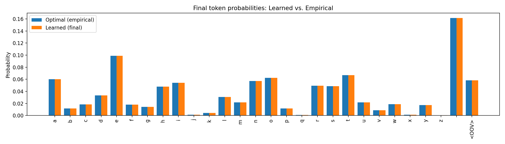
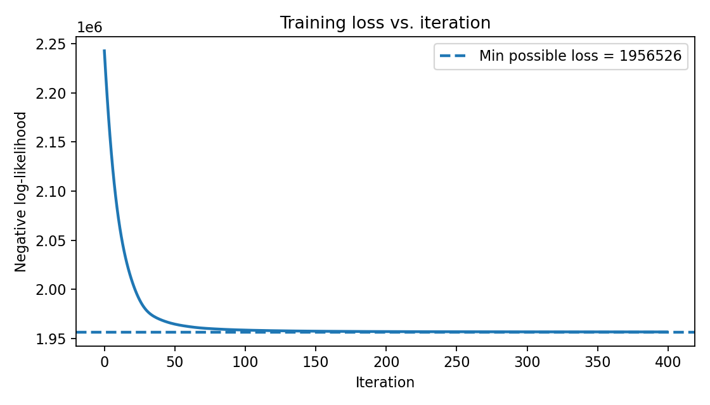

# Gradient descent

## 1. What does this neural network do? What are its inputs and outputs?

This model is a **character-level unigram language model**.  
It learns how often each character (letters *a–z*, the space `" "`, and an “unknown” symbol) appears in the training text, and assumes each character occurs independently.

- **Input:** The training text is split into individual characters and converted into a one-hot matrix  
  \(X \in \mathbb{R}^{V \times T}\), where \(V\) is the vocabulary size and \(T\) is the number of characters.  
- **Parameters:** A learnable vector \(s \in \mathbb{R}^{V}\), which is transformed into log-probabilities with `LogSoftmax`.  
- **Output:** The forward pass returns the **log-likelihood of the entire document**:  

\[
\log p(\text{text}) = \sum_{v=1}^V \text{count}(v) \log p(v).
\]

- **Loss function:** The model minimizes the **negative log-likelihood (NLL)** so that frequent characters in the training text are given higher probability.

---

## 2. Training hyperparameters

We used the **Adam optimizer** with:

- `num_iterations = 400`  
- `learning_rate = 0.05`  

---

## 3. Results and visualizations

### a) Final token probabilities vs. optimal empirical probabilities

The figure above compares learned probabilities against the optimal empirical probabilities (MLE solution):  
- **Blue (empirical):** Probabilities given directly by character counts in the training text.  
- **Orange (learned):** Probabilities learned by the model.  

These two distributions align almost perfectly, confirming the unigram model recovered the maximum likelihood solution.

---

### b) Training loss curve with minimum possible loss

The figure above shows the training loss (negative log-likelihood) across iterations:  
- **Blue line:** Training loss values.  
- **Dashed line:** The theoretical minimum loss, computed from the empirical distribution.  

The curve decreases quickly and approaches the dashed baseline, showing correct convergence.

---

## 4. How to extend the model for document classification

The unigram model can be adapted into a **document classifier** in two main ways:

1. **Linear classifier on bag-of-words:**  
   - Represent each document as a vector of token counts \(\mathbf{c}_d\).  
   - Apply a linear layer: \(\mathbf{z}_d = W \mathbf{c}_d + b\).  
   - Use `softmax(\mathbf{z}_d)` for class probabilities.  
   - Train with cross-entropy loss.

2. **Class-specific unigram distributions (Naive Bayes style):**  
   - Each class \(c\) has its own parameter vector \(s^{(c)}\).  
   - Convert to probabilities \(p(v|c)\) with `LogSoftmax`.  
   - Score a document by:  

   \[
   \log p(\text{doc}|c) = \sum_v c_d(v) \log p(v|c).
   \]

   - Combine with class priors to get posterior probabilities and choose the most likely class.

Both approaches extend the generative unigram model into a discriminative classifier.

---

## Conclusion

The PyTorch implementation of the unigram language model successfully learns the maximum likelihood distribution over characters. Gradient descent converges quickly to the empirical optimum, and the model can be naturally extended to document classification tasks.